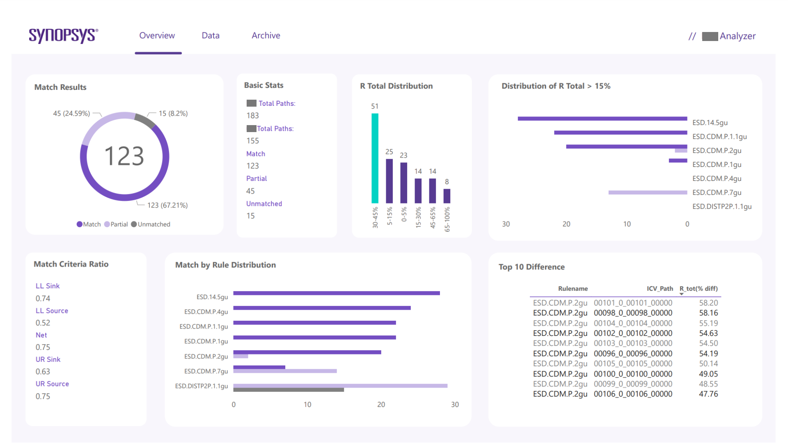
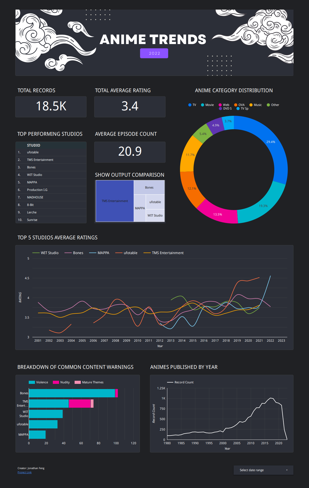
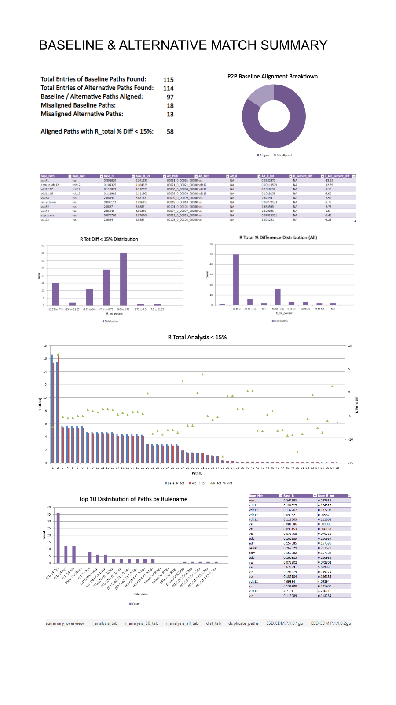

# Dashboard-Example

Here are some samples of my dashboarding work from either jobs or personal projects.

## PowerBI output [Work]

This is an early version of my dashboard (non NDA) for a comparison on semi-condoctor processes and attributes.
There are alternative formats in text file and flaskapp but is not included here.

## Anime Dashboard [PROJECT]

This is the looker result of my project for my data engineering project, you can find out more in the corresponding repository.

[Link to Data Engineering Project](https://github.com/jaytar0/DE_flow_anime_2022)

[Link to Live Dashboard](https://lookerstudio.google.com/s/mLPRgy9NtaM)

## Excel Output [Work]
This is the excel version of what the power-bi output gives. These are automatically generated on each run of this comparison process and can be reoccuringly scheduled via script processes.

