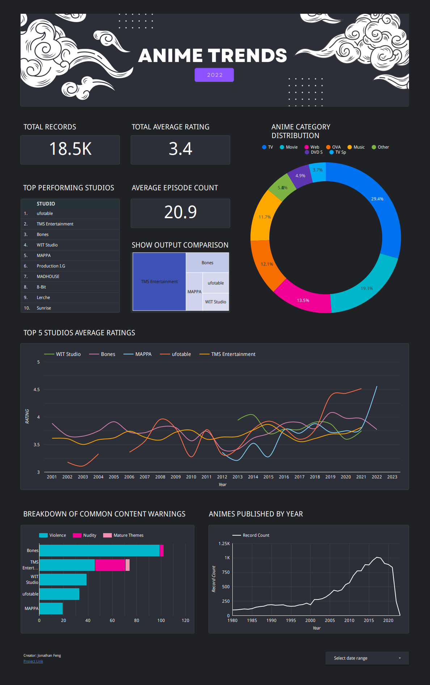

# Dashboard-Example

Here are some samples of my dashboarding work from either jobs or personal projects.

## PowerBI output [Work]

This is an early version of my dashboard (non NDA) for a comparison on semi-condoctor processes and attributes.
There are alternative formats in text file and flaskapp but is not included here.

## Anime Dashboard [PROJECT]
This is the looker result of my project for my data engineering project, you can find out more in the corresponding repository.

## Excel Output [Work]
This is the excel version of what the power-bi output gives.

